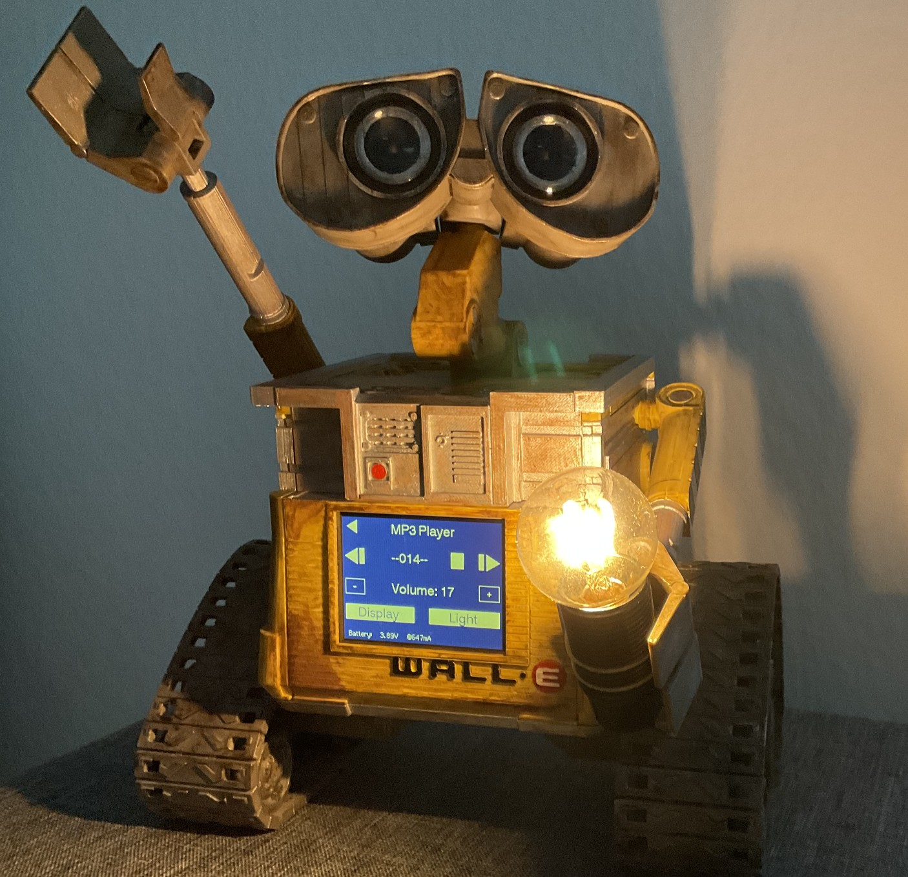
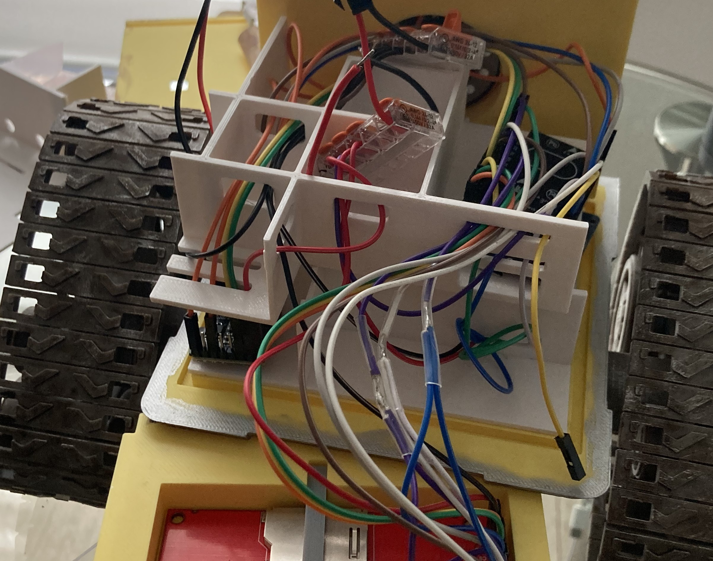

# Wall-E Robot Project

## About

This project is about designing a Wall-E robot alarm clock. The model is printed using a 3D printer and then equipped with hardware. It is based on the original model of Jérôme. You can find the original model here. I will refer to the model several times:

<https://www.printables.com/de/model/844971-wall-e-alarm-clock-lamp>

<https://jeje-linge.fr/pages/wall-e>

The main reason for changing the base model was safety concerns regarding the lithium-ion battery. The original charger is not designed to charge the battery in parallel while the system is active. For this reason I replaced the charger with another one, which necessitated further changes to the 3D model. Additionally, I created three inlays for the interior of the model to store the electronic components more securely and reduce the risk of a short circuit. Finally, I completely rewrote the program code and added additional features.

The required modified print-STL-files can be found here:

<https://www.printables.com/de/model/919983-wall-e-robot-alarm-clock-remix>

Here is a video clip of my Wall-E alarm clock in action :-)

 

## Credits

Thanks to Jérôme for his great work in designing the original model. Please support him and buy the required hardware components from his web-shop. I will link it in the descriptions further below.

## Disclaimer and Legal Information

This project comes with absolutely no warranty. Use it at your own risk. I make no guarantees or promises regarding the reliability, suitability, or security of this project. Any actions you take with the code from this repository are at your own discretion and responsibility.

Before handling with lithium batteries, make sure to read the corresponding safety instructions. Before powering the system up, double check if all cables are connected correctly. When powering the system by the USB-port of the ESP32, always disconnect the battery charger module, first. Never charge the battery unattended.

This repository may contain hyperlinks to external websites or resources. These links are provided for convenience and informational purposes only. I do not endorse or take responsibility for the content, accuracy, or availability of these external sites. Accessing these links is at your own risk.

Feel free to adapt, modify and share the source code. Leave me a star in github, if you like my project.

## Images

|    |    |    |
|----|----|----|
|   |   |   |
|   |   |   |
|   |   |   |
|   |   |   |
|   |   |   |
|   |   |    |

## Feature Overview

The basic feature is to support an alarm clock. When the alarm turns on, MP3s will be played from a SD-card and a light bulb turns on. There is a small speaker built into the back of the robot to allow MP3-playback. User-Interaction is handled by the touch display.

Here is a small list of features:

* Alarm clock
  * can be turned on and off
  * is stored in memory of the RTC clock and still available after power loss (as long as the RTC is powered by a CR2032 battery)
  * several adjustable modes: alarm each day, alarm at weekdays only, alarm at weekend only
* Kitchen Timer with animations
* Alarm auto-shutdown when the user did not react within a certain time
* Notification center
  * Shows missed alarms
  * Shows general system information
* Light Bulb
  * can be turned on manually or when the alarm fires
  * will automatically be shut-off after a certain time
  * Safety feature: Will not turn on, when battery voltage is low
* MP3 playback from SD-card
* 320 x 240 pixels touch display
* Deep-Sleep / Stand-By mode
  * When no interaction occurs the system will go to deep sleep. The ESP32 and the display back light are powered off.
  * In this mode the whole power consumption is <50mA
  * The system restarts when an alarm fires or the user touches the display
* Executes automatic adjustments to the RTC due to time changes (DST / summer time)
  * The adjustments are part of the program code
  * An internal alarm will fire when the clock needs adjustment and execute
* GIF-animations - Wallllll-EEEEE :-)
* Optional Over-the-Air update by WiFi
* Can be operated with and without a battery
* Battery can be charged while the system is active
* Monitoring of battery voltage and electrical current flow
  * Will also identify when operating on USB power
  * Will also show the current the battery is charged with
* Battery undervoltage and overvoltage protection by the charger
* Regulated 5V power output to the hardware connected to the charger (max 1A output recommended)

## Hardware Requirements

The following components can be used from Jérôme's base model. Please purchase through his web shop to support him (<https://jeje-linge.fr/pages/wall-e>):

* 1 Channel 5V Relay Module
  * make sure a flyback diode is integrated (should always be the case, though)
* Micro SD Card <=16GB
  * used to store the MP3s
  * SD-cards > 16GB might work when setting the partition to allocate <=16GB of memory
* Mini MP3 Player Module
  * there are several modules on the marked - each with certain limitations
  * I tested with several “MP3-TF-16P v3.0“ modules which work quite good
* Speaker 8 ohms 2W (40mm diameter)
* 2x 29mm arcylic convex lense
* at least 5x Wago terminals
  * for testing the hardware I recommend some more, so you can test everything before soldering
* ESP32 Dev Module
  * I used the model “ESP32-WROOM-32D“
* 5V Light Bulb <= 500mA
  * These are not easy to get.
  * <https://de.aliexpress.com/item/1005004278386597.html>
* 2.8” TFT Touch Screen 320x240
  * chipset is “ILI9341“
* Lots of Wires - Dupont Female to Female
  * For battery connection to the charger, charger connection to the system and the light bulb, I recommend AWG22 or AWG24 wires.
* DS3231 RTC clock

Due to my modifications, you will need the following additional hardware:

* USP 18650 Lithium-Ion Battery charger with integrated 5V boost:
  * <https://www.amazon.de/dp/B0B6SPMJZB>
    * tested and works flawlessly
    * Important: Amazon seems to sell the version with soldered battery holder now - This version does not fit - you can try to desolder the battery box, though.
  * or <https://de.aliexpress.com/item/1005005714456736.html>
    * not yet tested
    * make sure to buy the “5V module” version
* Self-Locking 27mm on/off switch, 2PIN, must support at least 1A
  * <https://www.amazon.de/dp/B0D1G6Y3FS>
* M3 non-conducting screws and nuts to fix the charger in place
  * I used nylon screws

Optional components:

* 18650 Lithium-Ion battery > 2000mAH
    * For a suitable battery, take a look at the chapter "Power Consumption" below.
    * I use a quality battery having 3200mAH. It lasts for about 40 to 50 hours (Light bulb not used, most time in stand-by).
    * The charger will charge the battery with 1A at max. Most 18650 batteries support charging with 0.5C. Make sure the battery supports that.
    * The charger has a built-in undervoltage and overvoltage protection. If you want additional safety, you can buy a battery that has an additional integrated protection circuit. Most 18650 batteries don’t have this additional circuit.
    * Make sure to read general safety recommendations when handling with lithium batteries.
* Adafruit INA260 power sensor
    * If the INA260 is not present, the software will assume that the system is powered by USB
* Cables to connect the battery to the charger
    * Depends on the battery and connection type
    * Make sure to use cables having 22AWG or better
    * <https://www.amazon.de/dp/B08JV9GR1Y>
* Optionally a small LiPo battery safety bag
* If you do not want to solder cables to the light bulb, use a bulbholder

Other hardware:

* shrinking tubes might be required
* USB-C power-supply >=1A
* USB-C cable

## Hardware Details

I will explain the reasons for changing some of the original hardware in this chapter.

### Battery Charger
The original version used a battery charger that (as far as I can tell as a non-expert) is not made for charging the battery and powering the robot at the same time. Internally, the same circuit is used for charging the battery and powering the system. The charger will not be able to detect when the battery is fully charged. The battery fill float around the maximum voltage and never stop charging. This leads to safety problems and a decreased battery lifetime. You can read more about this here:
<https://emariete.com/en/co2-meter-with-battery-well-done/>

Within the original version there neither was a 5V boost integrated. The system was powered by battery voltage. This can lead to instabilities of the ESP32, as the supplied voltage will vary depending on the battery charge level. 

It took me a long time to find a better and more safe battery charger. The battery charger I chose has the following features (although I was able to verify most things, please note that I am not an expert):
* Battery will be disconnected when the voltage drops below 2.5V
    * This is an important safety feature - do never discharge lithium-ion batteries below 2.5V. Better stop at 3V
* Battery is charged at max. by 1A.
* When USB is connected, the system will be powered by USB and not by battery.
* The battery is optional. The system will also work without a battery.
* When the battery is fully charged, charging stops and the robot will be powered by USB power. The battery circuit is disconnected.
* The charger allows to solder an on/off switch to power-off the system (more precisely the output-power of the charger).
* Output power is boosted to stable 5V with a maximum current of 1A
* Not verified but documented within the datasheets:
    * overvoltage protection
    * input undervoltage protection
    * short circuit protection

### Battery Voltage Monitoring
Within the original version, battery voltage was monitored by the ESP32 ADC (analog digital converter). However, measuring the voltage by the ESP32 is not very accurate. Furthermore I wanted to monitor the electric current leaving the battery.

For these reasons I switched to the Adafruit INA260 sensor. It allows to monitor the battery voltage and current at the same time. This also allowed me to distinguish whether the system is powered by USB (battery current around 0mA if the battery is charged) or if the system does charge the battery (battery current is negative).

## Power consumption
I did a lot of tests and measured the power consumption in different system states. The power was measured at the battery before entering the 5V boost. This is important because the boost-module will add a little overheat. Note that the boost module can supply a constant maximum of 1A. When modifying the hardware you should take this into account.

### Deep Sleep / Stand-By
In this state the ESP32 is in Deep-Sleep mode and the display backlight is turned off. This mode will automatically get active, when the user is not interacting with the system after a certain amount of time. The system will wake-up once an alarm fires or the user touches the display. The power consumption is between <strong>45 and 60mA</strong>. This heavily depends on the components used. As an example, I tested two different MP3 modules. Although having the same chip, the power consumption differed to a small degree. Officially, the MP3 module supports a sleep mode, as well. I was able to put the module into sleep mode. However, the module did not wake up when sending commands. It is known that these MP3 modules are a little restive and not always strictly follow the specifications. I gave up putting the MP3 module into sleep mode. Further power can be saved when de-soldering the LEDs of the components. As the LED of the relay was quite bright, I de-soldered it. I left all other LEDs in place.

### Normal operation
In normal operation, all components except the light bulb and MP3 playback are active. The system uses between <strong>250 and 300mA</strong>.

### MP3 playback
Add another <strong>70 to 150mA</strong> to the normal operation mode power consumption. This heavily depends on the MP3 and playback volume.

### Light Bulb
I use a different light bulb as described above, since no 5V light bulb was available when I assembled my Wall-E. Add another <strong>400 to 500mA</strong> to the normal operation mode power consumption.

## Hardware Setup
<strong>Important:</strong>
* Prepare everything, but do not yet power things up. We will do this later.
* Note: For the initial ESP32 setup later on we require the ESP32 to not be connected to any peripherals/PINs.
* Cables can be connected using the Wago terminals.
* Leave the battery disconnected for now.

### Cabling
Use the following image for the setup. I will go in more details below. In github-folder "images" you will probably find the image in better resolution. 

<strong>Please note that although I tested the setup, I do not provide any warranty. Use at your own risk.</strong>
 

### Battery Charger Setup
The battery charger has two operating modes:
* Constant 5V power output
* On-/Off switchable 5V power output

I decided to be able to switch off power. To do so, solder an On/Off-switch to the charger as shown in the image below. Make sure that the jumper pads above are not soldered, since this will put the system into constant 5v output:

### RTC preparation
I always like to power-off the robot when I am not at home (although note that the battery will still be discharged by 1mA by the safety circuits). It would be quite cumbersome to program the clock and the alarm each time when powering-on the system again. The RTC module has the option to operate with a CR2032 battery when no other power source is available. That is great. However, the RTC has a build in charger and will try to charge the CR2032 battery (which is not possible and therefore unsafe). To disable the onboard-charger of the RTC you have to de-solder resistor R4 (may have a different name on your component) or the diode as shown in the image below. Further details can be found here:
<https://www.onetransistor.eu/2019/07/zs042-ds3231-battery-charging-circuit.html>

Do not forget to put the battery inside before assembling the robot ;-)

### TFT preparation
As described in the picture, certain PINs of the TFT display must be connected together. You can either solder the PINs directly using a wire, or prepare/solder a cable having three ends. I used the latter option.

Please note that the TFT can operate at 5V and 3.3V. In our case we have 5V. On the back of the display there is a small jumper "J1". Make sure that it is <strong>not</strong> soldered. Otherwise the TFT will run in 3.3V mode:

### 5V Relay-Module
There is no real need to solder the relay. However, the LED of my relay was so bright that it shined through the printed parts. Therefore, I de-soldered it.

### MP3 preparation
Use an empty SD-card and place at least one MP3 on it with the following structure (filenames and folder-names are really important):

Due to copyright reasons I do not provide MP3s. You can find a nice set of MP3s here:
<https://www.printables.com/de/model/844971-wall-e-alarm-clock-lamp/files>

Place the SD-card into the MP3 player module. 

Note:
* The SD-card must be formatted using FAT32
* The partition must not exceed 16GB
  * I successfully tested with a 32GB SD card and a 16GB partition.
* Double check the file- and folder-names if MP3s are not played

## Software Setup

### Arduino IDE
You need to use the Arduino IDE v2. Clone this github repository and copy the sub-folder "wall-e" (located in "src") to the workspace of your Arduino IDE installation.

### Install missing libraries
From the Arduino IDE, install the following libraries (the libraries might need additional dependencies - let the IDE install these dependencies for you). I will also provide the github links in case the IDE cannot find the dependencies:
* Adafruit GFX Library
    * <https://github.com/adafruit/Adafruit-GFX-Library>
* Adafruit INA260 Library
    * <https://github.com/adafruit/Adafruit_INA260>
* Animated GIF by Larry Bank
    * <https://github.com/bitbank2/AnimatedGIF>
* ArdBitmap by Ignacio Vina
    * <https://github.com/igvina/ArdBitmap>
* DFPlayerMini_Fast by PowerBroker2
    * <https://github.com/PowerBroker2/DFPlayerMini_Fast>
* AsyncTCP by me-no-dev
    * <https://github.com/me-no-dev/AsyncTCP>
    * Make sure to use excactly this library - forks of this library did not compile in my tests
    * You might need to download it manually and place it within the library folder of the Arduino IDE
* ESPAsyncWebServer by me-no-dev
    * <https://github.com/me-no-dev/ESPAsyncWebServer>
    * Make sure to use excactly this library - forks of this library did not compile in my tests
    * You might need to download it manually and place it within the library folder of the Arduino IDE
* ElegantOTA by Ayush Sharama
    * <https://github.com/ayushsharma82/ElegantOTA>
* BusIO by Adafruit
    * <https://github.com/adafruit/Adafruit_BusIO>
* Tom_RTCLib by Tom-got-it (this is my fork of the Adafruit RTCLib as I needed to add additional features)
    * <https://github.com/tom-got-it/Tom_RTClib/>
    * You might need to download it manually and place it within the library folder of the Arduino IDE
* TFT_eSPI by Bodmer
    * <https://github.com/Bodmer/TFT_eSPI>

### Configure the ElegantOTA library
Within the library folder of your Arduino installation find and open the following file:
"libraries/ElegantOTA/src/ElegantOTA.h"

Find the following line and make sure there is a "1":

    #define ELEGANTOTA_USE_ASYNC_WEBSERVER 1

### Configure the TFT library
Within the library folder of your Arduino installation find and open the following file:
"libraries/TFT_eSPI/User_Setup.h"

Make sure to uncomment and refine the settings such that afterwards the file looks like this. I will also provide my file within in my project ("rsc/User_Setup.h").

    #define USER_SETUP_INFO "User_Setup"

    #define ILI9341_DRIVER       // Generic driver for common displays

    #define TFT_MISO  PIN_D6  // Automatically assigned with ESP8266 if not defined
    #define TFT_MOSI  PIN_D7  // Automatically assigned with ESP8266 if not defined
    #define TFT_SCLK  PIN_D5  // Automatically assigned with ESP8266 if not defined

    #define TFT_CS    PIN_D8  // Chip select control pin D8
    #define TFT_DC    PIN_D3  // Data Command control pin
    #define TFT_RST   PIN_D4  // Reset pin (could connect to NodeMCU RST, see next line)

    #define TFT_MISO 19
    #define TFT_MOSI 23
    #define TFT_SCLK 18
    #define TFT_CS   15  // Chip select control pin
    #define TFT_DC    2  // Data Command control pin
    #define TFT_RST   4  // Reset pin (could connect to RST pin)

    #define TOUCH_CS 5     // Chip select pin (T_CS) of touch screen

    #define LOAD_GLCD   // Font 1. Original Adafruit 8 pixel font needs ~1820 bytes in FLASH
    #define LOAD_FONT2  // Font 2. Small 16 pixel high font, needs ~3534 bytes in FLASH, 96 characters
    #define LOAD_FONT4  // Font 4. Medium 26 pixel high font, needs ~5848 bytes in FLASH, 96 characters
    #define LOAD_FONT6  // Font 6. Large 48 pixel font, needs ~2666 bytes in FLASH, only characters 1234567890:-.apm
    #define LOAD_FONT7  // Font 7. 7 segment 48 pixel font, needs ~2438 bytes in FLASH, only characters 1234567890:-.
    #define LOAD_FONT8  // Font 8. Large 75 pixel font needs ~3256 bytes in FLASH, only characters 1234567890:-.
    #define LOAD_GFXFF  // FreeFonts. Include access to the 48 Adafruit_GFX free fonts FF1 to FF48 and custom fonts

    // Comment out the #define below to stop the SPIFFS filing system and smooth font code being loaded
    // this will save ~20kbytes of FLASH
    #define SMOOTH_FONT

    #define SPI_FREQUENCY  27000000

    #define SPI_READ_FREQUENCY  20000000

    #define SPI_TOUCH_FREQUENCY  2500000

### Setup Timezone and Time Changes
In the following steps I will always refer to the "wall-e" Arduino project folder.

Open file "include/timezone.h". Here you can place time changes due to summer-time or DST. At the given time the clock will be corrected by the offset (in hours).

### Setup Basic Configuration
Open file "include/global.h" and modify the settings as you need.
Some details:
* For over-the-air updates, enter your WiFi SSID and password. You also must set the WiFi security settings accordingly (WPA2, WPA3,...).
* Verify that the GPIO-Pin-Settings are correct

### Animated GIFs
When powering the system up the first time and on each alarm, a GIF animation is shown on the display. Due to copyright reasons I did not include the GIF.
Follow these steps to include a nice GIF animation:
* search for a nice GIF on the web
* edit the GIF such that it has 320x240 pixels
    * you also might reduce the amount of colors and frames to decrease the size
    * you can use this tool for example: <https://ezgif.com/maker>
* convert the GIF to a C-Byte-Array using this tool: <https://github.com/bitbank2/image_to_c>
* place the contents of the byte-Array in file "include/gif/walle-gif-main.h"
    * the byte-array must have the name "WALLE_GIF_MAIN"

Example:

    #ifndef PROGMEM
    #define PROGMEM
    #endif
    const uint8_t WALLE_GIF_MAIN[] PROGMEM = {
        0x47,0x49,0x46,0x38,0x39,0x61,0x40,0x01,0xf0,0x00,0xf4,0x00,0x00,0x19,0x11,0x10,
        0x27,0x1b,0x17,0x2d,0x16,0x0d,0x32,0x22,0x1b,0x37,0x2b,0x27,0x27,0x1f,0x20,0x4b,
        ...
        };

When the array is empty, no GIF animation will be shown.

### ESP32 Arduino Setup
First setup the Arduino IDE to use the ESP32 Dev Board.
An instruction and a Test-Setup can be found here. Please disconnect the ESP32 from all peripherals first. Please note that in our case the Board name is "ESP32 Dev Module":
<https://randomnerdtutorials.com/installing-esp32-arduino-ide-2-0/>

### ESP32 Programming and First Boot
For the first setup I strongly recommend to use a minimal setup:
* ESP32
* RTC
* TFT display

<strong>Important:</strong>
* When programming the ESP32 by USB, disconnected the battery charger from the system.
* The battery charger is not made for receiving input power from a different source.
* When testing the hardware and powering the system by the ESP32 USB-port, do not use the light bulb. It will draw too much current.

First we need to change the partition scheme of the On-Board flash memory, since the animated GIFs (when included) are quite large. I chose the following scheme:
"Tools->Partition Scheme -> Minimal SPIFFS".

Afterwards the code should compile and can be transferred to the ESP32. The ESP32 should boot-up and the basics should work:
* clock and alarm
* sleep-mode and wake-up

Note that you can use the Serial Monitor from the Arduino IDE to get debug output from the ESP32. This might be quite helpful to solve possible problems.

### Extended Tests
First unplug the ESP32 from the USB connection. Then setup all other hardware. Keep the battery disconnected for the first tests. Power the charger by USB (do not connect the ESP32 to USB!). Everything should work now.

After testing everything, test if battery operation works, as well. Especially test if the battery is charged and if charging stops at 4.2V. At least for the first charge process I recommend to place the battery within a LiPo safety bag. Check a couple of time whether the battery is getting hot - this should not be the case.

## Over the Air Udates
The system supports over-the-air (OTA) updates by WiFi. As explained above, you must configure your SSID and WiFi password.
To put the robot into OTA-mode, go to the main menu (touch the voltage bars or the USB/Charge symbol) and then select "Firmware". Then, the firmware update screen is shown. The ESP32 will try to start WiFi and also print the URL for updates. Open that URL in a browser and upload a new firmware file. To create a firmware file, click in the Arduino IDE at "sketch->Export compiled Binary". The "bin"-file with the name of your project is the firmware-file.

## Printing the Model
Except for the back-part of the robot, use the original STL-files and the original instructions. Do not yet glue the side-walls:

<https://www.printables.com/de/model/844971-wall-e-alarm-clock-lamp>

For the back-part you will need my modified STL file. This modified model allows to screw the charger onto the back. Additionally there is a hole for the on/off switch. Please note that the dimensions of the charger might change a little depending on the vendor and revision of the charger. You might need to modify the placement of the holes. 

Additionally I prepared three stackable inlays. This will help to increase product safety. Since the charger can get quite warm, I recommend to print the inlays with PETG. You can find the modified files here:

<https://www.printables.com/de/model/919983-wall-e-robot-alarm-clock-remix>

For painting the model, follow the original instructions.

## Putting things together
I assume the following has been done before:
* All parts are printed and painted
* The hardware is tested and works

Follow the original instructions and glue everything <strong>apart from the main-body</strong> together.

For the main-body it is sufficient to only glue the <strong>back</strong> and <strong>side-walls</strong> to the <strong>bottom</strong> as shown in the image below (not yet glued within my image). When glueing you should place the top and front-plate as well (without glue) such that everything fits together afterwards.

When the back and side-walls are glued, start placing the inlays and put the hardware inside. The charger can be screwed onto the first inlay and to the back-part using M3 nylon screws. I used the following layout (starting from layer 1 to 3 from left to right - see below).

<strong>Remark:</strong>
The real time clock (RTC) is quite hard to reach once everything is put together. Make sure to put a CR2032 battery in it, if you want to use it ;-) The battery should last a couple of years (at least I hope so...).

|    |    |    |
|----|----|----|
|   |   |   |
|   |   |   |

Note that I did not glue the front-side and the top-plate. This allows me to easily access the components when something is wrong. The front-part can be lifted upwards and taken apart:

## Final words
It was fun building the robot. I hope you will enjoy it as well.

Kind regards,
Tom
